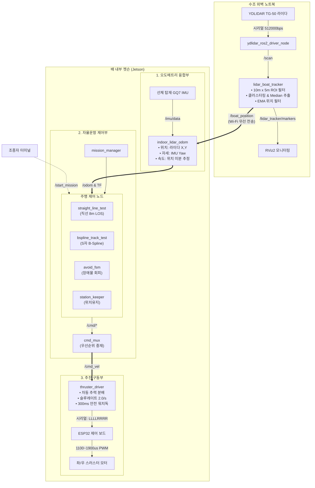

# KABOAT 전체 시스템 데이터 흐름도 (Data Flow Architecture)

이 문서는 **실내 수조 자율운항 테스트 환경**에서 수조 외벽 노트북, 배 내부 젯슨(Jetson), 센서 및 모터 구동계 간의 전체 데이터 흐름과 토픽 인터페이스를 정의합니다.

> 💡 **웹 브라우저로 바로 보기**:  
> 마크다운 뷰어에서 다이어그램이 안 보이시면 같은 폴더의 **[`SYSTEM_DATAFLOW.html`](file:///home/jiwoo/Desktop/2026KABOAT_REAL/SYSTEM_DATAFLOW.html)** 파일을 더블클릭하여 크롬(Chrome)이나 브라우저로 여시면 그래픽 다이어그램을 바로 보실 수 있습니다.

---

## 🔲 1. 텍스트 아키텍처 흐름도 (ASCII Diagram)

```
[ 💻 수조 외벽 노트북 ]
   │
   ├─► [ YDLIDAR TG-50 라이다 ] ──(시리얼 USB)──► [ ydlidar_ros2_driver_node ]
   │                                                     │
   │                                                     ▼  /scan (10Hz LaserScan)
   │                                              [ lidar_boat_tracker ]
   │                                              (수조 10mx5m ROI + 중앙값 필터)
   │                                                     │
   │                                                     ├─► [ RViz2 모니터링 ]
   │                                                     ▼
   └───────────────────► 토픽: /boat_position (10Hz, 배의 X,Y 절대위치) ─────────────┐
                                                                                     │ (Wi-Fi 무선 전송)
[ 🚤 배 내부 젯슨 (Jetson) ]                                                          │
   ┌─────────────────────────────────────────────────────────────────────────────────┘
   │
   ▼
[ indoor_lidar_odom 노드 ] ◄── /imu/data (50Hz) ── [ 선체 GQ7 IMU 센서 ]
   (라이다 실측 X,Y + 선체 IMU 실측 선수각 Yaw/자이로 융합)
   │
   ▼ 토픽: /odom (20Hz Odometry) & TF (odom -> base_link)
   │
[ 자율운항 경로추종 제어 계층 ]
   ├─► mission_manager (/mission/state, /mission/goal)
   ├─► straight_line_test (직선 8m 주행 시험)  ──┐
   ├─► bspline_track_test (S자 B-Spline 시험)  ──┼─► [ cmd_mux ]
   ├─► avoid_fsm (장애물 회피 FSM)             ──┘      │
   └─► station_keeper (지정좌표 위치유지)               ▼ 토픽: /cmd_vel (10~20Hz Twist)
                                                  [ thruster_driver ]
                                                  (좌우 차동 분배, 슬루레이트, 300ms 워치독)
                                                        │
                                                        ▼ 시리얼: "LLLLRRRR\n" (예: 15001500\n)
                                                  [ ESP32 모터 제어 보드 ]
                                                        │
                                                        ▼ 50Hz PWM (1100 ~ 1900 μs)
                                                  [ 좌 / 우 스러스터 모터 (ESC) ]
```

---

## 🗺️ 2. Mermaid 그래픽 다이어그램



---

## 📋 3. 노드별 입출력 토픽 계약 (Topic Interface Contract)

| 노드명 (`Node`) | 구독 토픽 (`Subscription`) | 발행 토픽 (`Publication`) | 설명 |
| :--- | :--- | :--- | :--- |
| **`ydlidar_ros2_driver_node`** | - | `/scan` (`LaserScan`) | TG-50 라이다 360° 원본 스캔 데이터 발행 (10Hz) |
| **`lidar_boat_tracker`** | `/scan` | **`/boat_position`** (`PointStamped`)<br>`/lidar_tracker/markers` (`MarkerArray`) | 수조 10m x 5m ROI 필터링 후 배의 2D 위치 발행 (10Hz) |
| **`gq7_driver`** | - | `/imu/data` (`Imu`) | 선체 탑재 GQ7 센서의 실제 방위각(Yaw) 및 각속도 발행 |
| **`indoor_lidar_odom`** | `/boat_position`<br>`/imu/data` | **`/odom`** (`Odometry`)<br>`/tf` (`odom -> base_link`) | 라이다 절대 위치와 IMU 선수각/자이로를 융합하여 최종 오도메트리 생성 (20Hz) |
| **`mission_manager`** | `/odom`<br>`/mission/complete` | `/mission/state` (`String`)<br>`/mission/goal` (`PoseStamped`) | 종합 미션 상태머신 순차 제어 (`gate` → `station` → `dock` → `search` → `avoid`) |
| **`straight_line_test`** | `/odom`<br>`/start_mission`<br>`/emergency_stop` | `/cmd/straight` 또는 `/cmd_vel` (`Twist`) | $(9.0, 3.0) \to (1.0, 3.0)$ 8m 구간 직선 LOS 추종 |
| **`bspline_track_test`** | `/odom`<br>`/start_mission`<br>`/emergency_stop` | `/cmd/bspline` 또는 `/cmd_vel` (`Twist`) | 수조 내부 S자 B-Spline 곡선 생성 및 Lookahead 추종 |
| **`cmd_mux`** | `/cmd/*` (각종 behavior 토픽)<br>`/mission/state` | **`/cmd_vel`** (`Twist`) | 현재 활성화된 미션의 속도 명령만 선택하여 최종 단일 명령으로 출력 |
| **`thruster_driver`** | `/cmd_vel` | `/cmd/rc_override_status`<br>ESP32 시리얼 스트림 | 속도 명령을 좌/우 차동 모터 PWM 값(`LLLLRRRR\n`)으로 변환하여 ESP32로 전송 |

---

## ⚡ 4. 안전 및 장애 대응 메커니즘 (Fail-Safe)

1. **라이다 신호 두절 감지 (`indoor_lidar_odom`)**:
   - 외부 라이다의 `/boat_position` 신호가 **1.0초 이상** 끊기면 즉시 `/odom` 발행을 중단합니다.
2. **모터 워치독 타이머 (`thruster_driver`)**:
   - `/cmd_vel` 신호가 **0.3초(300ms) 이상** 갱신되지 않으면 자동으로 스러스터 출력을 중립(`1500µs`, 정지)으로 강제 리셋합니다.
3. **수조 벽면 충돌 가드 (`Wall Guard`)**:
   - `straight_line_test` 및 `bspline_track_test`는 배가 수조 4면 벽면 **0.5m 이내**로 접근하면 즉시 비상 정지합니다.
4. **원격 비상 정지 (`Emergency Stop`)**:
   - 노트북에서 언제든 `ros2 topic pub --once /emergency_stop std_msgs/msg/Empty "{}"`를 발행하여 모터를 즉각 정지시킬 수 있습니다.
