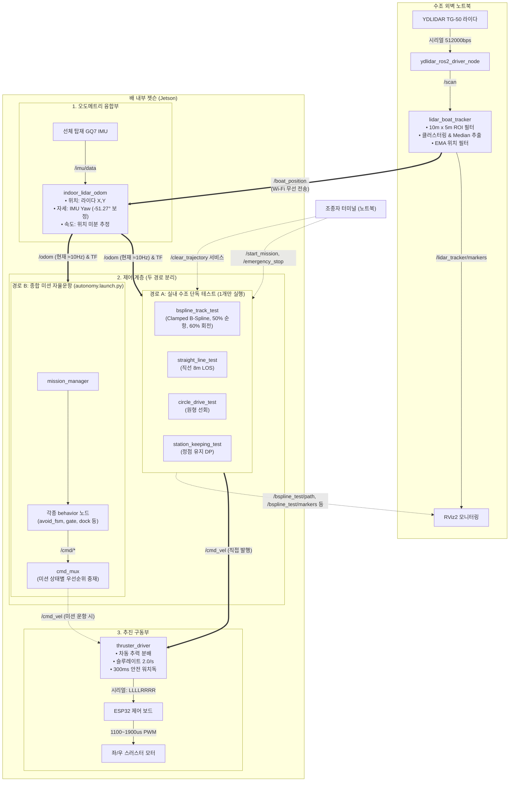

# KABOAT 전체 시스템 데이터 흐름도 (Data Flow Architecture)

이 문서는 **실내 수조 자율운항 테스트 환경**에서 수조 외벽 노트북, 배 내부 젯슨(Jetson), 센서 및 모터 구동계 간의 전체 데이터 흐름과 토픽 인터페이스를 정의합니다.

---

## 🔲 1. 텍스트 아키텍처 흐름도 (ASCII Diagram)

```
[ 💻 수조 외벽 노트북 ]
   │
   ├─► [ YDLIDAR TG-50 라이다 ] ──(시리얼 USB)──► [ ydlidar_ros2_driver_node ]
   │                                                     │
   │                                                     ▼  /scan (10Hz LaserScan)
   │                                              [ lidar_boat_tracker ]
   │                                              (수조 10mx5m ROI + 중앙값 필터)
   │                                                     │
   │                                                     ├─► [ RViz2 모니터링 ]
   │                                                     │   (/bspline_test/path, /bspline_test/markers 등)
   │                                                     ▼
   └───────────────────► 토픽: /boat_position (10Hz, 배의 X,Y 절대위치) ─────────────┐
                                                                                     │ (Wi-Fi 무선 전송)
[ 🚤 배 내부 젯슨 (Jetson) ]                                                          │
   ┌─────────────────────────────────────────────────────────────────────────────────┘
   │
   ▼
[ indoor_lidar_odom 노드 ] ◄── /imu/data (50~100Hz) ── [ 선체 GQ7 IMU 센서 ]
   (라이다 실측 X,Y + 선체 IMU 실측 선수각 Yaw/자이로 융합)
   │
   ▼ 토픽: /odom (현재 위치 표본률 ≈10Hz) & TF (odom -> base_link)
   │
   ├─── [ 경로 A: 실내 수조 단독 테스트 (Tank Test Direct Path — 1개 노드만 선택 실행) ]
   │    │  (bspline_track_test / straight_line_test / circle_drive_test / station_keeping_test)
   │    │
   │    └─────────────────────────────────────────────────────────────┐
   │                                                                  │ (직접 단독 제어)
   │                                                                  ▼
   └─── [ 경로 B: 종합 미션 자율운항 (Full Mission Stack — autonomy.launch.py) ]
        │  (gate / station / dock / search / avoid_fsm)               │
        │                                                             │
        ├─► 각 behavior 노드 ──► 토픽: /cmd/* (Twist)                │
        │                                    │                        │
        └─► [ cmd_mux ] ◄── /mission/state ──┘                        │
            (상태 기반 우선순위 선택 및 300ms 워치독)                 │
            │                                                         │
            ▼ 토픽: /cmd_vel (10~20Hz Twist)                          │
   ┌────────┴─────────────────────────────────────────────────────────┘
   │
   ▼ 토픽: /cmd_vel (Twist)
[ thruster_driver ]
(좌우 차동 분배, 슬루레이트 2.0/s, 300ms 안전 워치독)
   │
   ▼ 시리얼: "LLLLRRRR\n" (예: 15001500\n)
[ ESP32 모터 제어 보드 ]
   │
   ▼ 50Hz PWM (1100 ~ 1900 μs)
[ 좌 / 우 스러스터 모터 (ESC) ]
```

---

## 🗺️ 2. Mermaid 그래픽 다이어그램



---

## 📋 3. 노드별 입출력 토픽 계약 (Topic Interface Contract)

| 노드명 (`Node`) | 구독 토픽 (`Subscription`) | 발행 토픽 (`Publication`) | 서비스 (`Service`) | 설명 |
| :--- | :--- | :--- | :--- | :--- |
| **`ydlidar_ros2_driver_node`** | - | `/scan` (`LaserScan`) | - | TG-50 라이다 360° 원본 스캔 데이터 발행 (10Hz, 노트북 소유) |
| **`lidar_boat_tracker`** | `/scan` | **`/boat_position`** (`PointStamped`)<br>`/lidar_tracker/markers` (`MarkerArray`) | - | 수조 10m x 5m ROI 필터링 후 배의 2D 절대 위치 발행 (10Hz, 노트북 소유) |
| **`microstrain_inertial_driver`** | - | `/imu/data` (`Imu`) | - | 선체 탑재 GQ7 센서의 자세(Yaw) 및 각속도 발행 (젯슨 소유) |
| **`indoor_lidar_odom`** | `/boat_position`<br>`/imu/data` | **`/odom`** (`Odometry`)<br>`/tf` (`odom -> base_link`) | - | 라이다 절대 위치와 IMU 선수각/자이로를 융합합니다. 검사 타이머는 30Hz지만 새 위치 표본마다 한 번만 발행하므로 현재 10Hz LiDAR 구성에서는 `/odom`도 약 10Hz입니다. |
| **`bspline_track_test`** | `/odom`<br>`/start_mission` (`Bool`)<br>`/emergency_stop` (`Bool`) | **`/cmd_vel`** (`Twist`, 직접 발행)<br>`/bspline_test/path` (`Path`)<br>`/bspline_test/markers` (`MarkerArray`) | `/start_test`<br>`/clear_trajectory` | Clamped B-Spline 곡선 생성 및 Lookahead 추종. **`cmd_mux` 없이 `/cmd_vel`로 직결** |
| **`straight_line_test`** | `/odom`<br>`/start_mission` (`Bool`)<br>`/emergency_stop` (`Bool`) | **`/cmd_vel`** (`Twist`, 직접 발행)<br>`/straight_drive/markers` (`MarkerArray`) | `/start_test`<br>`/clear_trajectory` | $(9.0, 3.0) \to (1.0, 3.0)$ 8m 구간 직선 LOS 추종. **`cmd_mux` 없이 `/cmd_vel`로 직결** |
| **`circle_drive_test`** | `/odom`<br>`/start_mission` (`Bool`)<br>`/emergency_stop` (`Bool`) | **`/cmd_vel`** (`Twist`, 직접 발행)<br>`/circle_drive/markers` (`MarkerArray`) | `/start_test`<br>`/clear_trajectory` | 중심점 기준 반경 1.2m 원 궤도 추종. **`cmd_mux` 없이 `/cmd_vel`로 직결** |
| **`station_keeping_test`**| `/odom`<br>`/start_mission` (`Bool`)<br>`/emergency_stop` (`Bool`) | **`/cmd_vel`** (`Twist`, 직접 발행)<br>`/station_keeping/markers` (`MarkerArray`) | `/start_test`<br>`/clear_trajectory` | 지정 좌표/선수각 정점 유지(가상 앵커). **`cmd_mux` 없이 `/cmd_vel`로 직결** |
| **`cmd_mux`** | `/cmd/*` (각종 behavior 토픽)<br>`/mission/state` | **`/cmd_vel`** (`Twist`) | - | **종합 미션 자율운항(`autonomy.launch.py`) 전용 중재기**. 현재 활성화된 behavior의 속도 명령만 선택하여 `/cmd_vel`로 출력 (수조 단독 테스트 시 미사용) |
| **`thruster_driver`** | `/cmd_vel` (`Twist`)<br>`/emergency_stop` (`Bool`)<br>`/rc/cmd_vel` (`Twist`) | `/diagnostics`<br>ESP32 시리얼 스트림 | - | 속도 명령을 좌/우 차동 모터 PWM 값(`LLLLRRRR\n`)으로 변환하여 ESP32로 전송 (젯슨 소유) |

---

## ⚡ 4. 안전 및 장애 대응 메커니즘 (Fail-Safe)

1. **라이다 신호 두절 감지 (`indoor_lidar_odom`)**:
   - 외부 라이다의 `/boat_position` 신호가 **1.0초(`pos_timeout_sec: 1.0`) 이상** 끊기면 즉시 `/odom` 발행을 중단합니다.
   - GQ7 `/imu/data`가 **0.5초(`imu_timeout_sec: 0.5`) 이상** 끊겨도 `/odom` 발행을 중단합니다.
2. **오도메트리 수신 타임아웃 (`bspline_track_test` 등 테스트 노드)**:
   - `/odom` 신호가 **0.5초(`odom_timeout_sec: 0.5`) 이상** 지연되면 테스트 노드가 즉시 속도 명령을 0으로 차단하고 안전 정지합니다.
3. **모터 워치독 타이머 (`thruster_driver`)**:
   - `/cmd_vel` 신호가 **0.3초(300ms) 이상** 갱신되지 않으면 자동으로 스러스터 출력을 중립(`1500µs`, 정지)으로 강제 리셋합니다.
4. **원격 비상 정지 (`Emergency Stop`)**:
   - 노트북에서 언제든 `ros2 topic pub --once /emergency_stop std_msgs/msg/Bool "{data: true}"`를 발행하여 모터를 즉각 정지시킬 수 있습니다.
5. **궤적 이력 초기화 (`Clear Trajectory`)**:
   - RViz 상의 실제 주행 궤적 이력을 초기화할 때 노트북에서 `ros2 service call /clear_trajectory std_srvs/srv/Trigger "{}"`를 호출합니다. 목표 경로와 미션 상태는 유지됩니다.
6. **직진 테스트 경계 가드**:
   - `straight_line_test`는 기본적으로 수조 벽에서 0.5m 안쪽의 안전 영역을 벗어나면 정지를 래치합니다. 현재 `bspline_track_test`, `circle_drive_test`, `station_keeping_test`에는 같은 경계 가드가 없으므로 목표 경로와 좌표를 운용 전에 확인해야 합니다.

수조 단독 테스트 경로와 종합 미션 경로는 모두 최종적으로 `/cmd_vel`을
사용합니다. 따라서 테스트 노드와 `cmd_mux`/자율운항 스택을 동시에 실행하면
안 됩니다.
